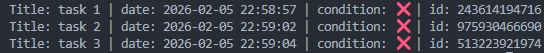

## CLI-ToDo-GO 
Command-line task manager with `json` persistence.

### Features 
- Persistent storage: Tasks saved in `storage.json`
- ID-based operations: Easy task management
- Cross-platform: Windows/Linux/Mac

### Installation and run
```git 
git clone https://github.com/1428Stef/CLI-ToDo-GO.git
.\ToDO.exe 
```

### Usage
```bash
./ToDo.exe [command] [args]
```

### Commands 
| Command | Argument           | Description                           |
| ------- | ------------------ | ------------------------------------- |
| add     | -title "Task name" | add a new task                        |
| done    | -id                | mark task as completed (ID from list) |
| list    | -                  | display all tasks                     |
| del     | -id                | delete task (ID from list)            |
| edit    | -id -title "Taks name | changes the task title (ID form list)| 
